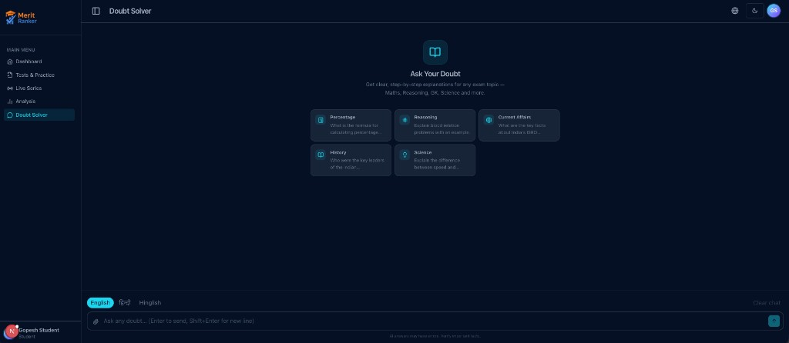
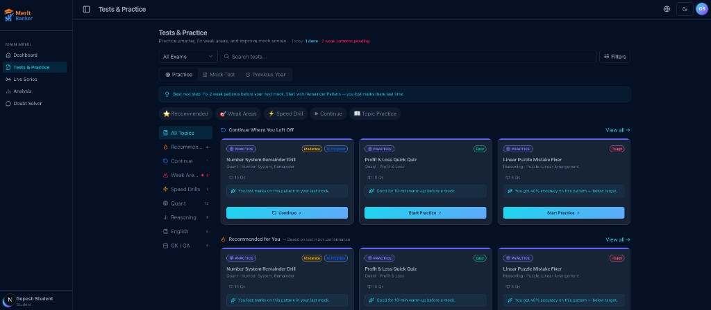

# MeritRanker Agent Python

Open-source Python agent toolkit for **education-focused AI workflows** and **exam-preparation use cases**.

Built with [LangGraph](https://github.com/langchain-ai/langgraph) and deployable via [Amazon Bedrock AgentCore](https://docs.aws.amazon.com/bedrock/latest/userguide/agents.html), this repository provides structured agent workflows—not a generic chat wrapper—for tutoring, doubt resolution, practice guidance, and answer validation.

> **Status:** Early-stage, actively developed. Suitable for local development, experimentation, and contribution. Not positioned as a finished commercial product.

---

## Demo

Screenshots from the MeritRanker education platform — the kind of student-facing workflows this agent toolkit is built to power. The UI lives in a separate frontend; **this repository is the Python agent backend** (doubt solver, routing, validation, streaming).

### Doubt Solver

Structured, subject-aware Q&A for exam prep — maths, reasoning, GK, science, and more.



### Tests & Practice

Practice guidance, weak-area targeting, and progress-aware recommendations alongside agent workflows.



---

## Why this exists

Generic AI chat is not enough for reliable learning. Education applications need:

- **Structured reasoning** — step-by-step explanations aligned to subject and difficulty
- **Validation** — schema-checked outputs and answer-quality gates before students see responses
- **Context-aware retrieval** — optional knowledge-base and record lookup (when enabled)
- **Educator review support** — workflows designed for human oversight, not fully autonomous grading
- **Testable boundaries** — mock-first development, explicit schemas, and offline pytest coverage

MeritRanker Agent Python packages these concerns into replaceable services, LangGraph workflows, and configuration-driven LLM routing so teams can build education agents without ad-hoc prompt spaghetti.

---

## Features and current direction

| Area | Description |
|---|---|
| **Education AI agent workflows** | LangGraph graphs with explicit state (`request_id`, `query`, `classification`, `context_text`, `answer`) |
| **Doubt-solving flow** | Classify student queries, retrieve context when configured, generate subject-aware explanations |
| **Structured reasoning steps** | Prompt templates and generator contracts for math, reasoning, and general subjects |
| **Practice guidance** | Intent overlays (solve, explain, practice, visualize) and difficulty-aware routing |
| **Educator review support** | Architecture oriented toward reviewable outputs; full review UI is out of scope for this repo |
| **Answer validation / evaluation** | Answer-quality checks, empty-output guards, continuation logic, and safe failure messages |
| **Schemas, tests, examples** | Pydantic v2 models, 1,800+ offline tests, smoke scripts, and developer docs |

**LLM orchestration** includes YAML-based route and model registry configuration, multi-provider adapters (Azure OpenAI, OpenAI, mock, and others), fallback chains, and streaming support for generator routes.

---

## Installation

### Prerequisites

- **Python 3.11+**
- **[uv](https://docs.astral.sh/uv/getting-started/installation/)** — Python package manager
- **Node.js 20+** — for the AgentCore CLI
- **AgentCore CLI** — `npm install -g @aws/agentcore`
- **AWS credentials** — only required for deployment or optional retrieval features

### Setup

```bash
git clone https://github.com/<your-org>/meritRankerTutor.git
cd meritRankerTutor

# Install Python dependencies
cd app && uv sync --group dev && cd ..

# Local environment (mock mode — no API keys required)
cp app/.env.local.example app/.env.local

# Verify tooling
make env
make check
agentcore validate
```

For the full environment variable reference, see [docs/dev/backend-env.md](docs/dev/backend-env.md).

---

## Quickstart

### 1. Run tests (offline, no credentials)

```bash
make check
```

### 2. Start the local agent

```bash
make dev
```

AgentCore starts a local HTTP server (default **http://localhost:8080**).

### 3. Send a doubt-solver request

In another terminal:

```bash
make smoke-doubt-solver
```

Or with curl directly:

```bash
curl -X POST http://localhost:8080/invocations \
  -H "Content-Type: application/json" \
  -d '{
    "mode": "doubt_solver",
    "query": "What is the formula for calculating percentage increase?",
    "user_id": "local-dev",
    "language": "en"
  }'
```

Mock mode (`ENABLE_REAL_LLM=false`, the default) returns deterministic placeholder answers without calling external providers.

### 4. Optional — real LLM providers

Set `ENABLE_REAL_LLM=true` and configure provider credentials in `app/.env.local`. See [docs/dev/backend-env.md](docs/dev/backend-env.md) for Azure OpenAI, OpenAI, and deployment mapping details.

Manual smoke targets (opt-in, not run in CI):

```bash
make smoke-llm-orchestration-mock      # orchestration dry-run, no network
make smoke-doubt-solver-real-llm       # requires running make dev + credentials
```

More examples: [examples/README.md](examples/README.md)

---

## Project structure

```
meritRankerTutor/
├── README.md                 # This file
├── LICENSE                   # MIT
├── CONTRIBUTING.md
├── SECURITY.md
├── ROADMAP.md
├── Makefile                  # test, lint, dev, smoke targets
├── AGENTS.md                 # AI coding-agent instructions
├── agentcore/                # AgentCore CLI / deployment config only (no Python app code)
│   ├── agentcore.json
│   └── cdk/
├── app/                      # All Python application code (deployed runtime)
│   ├── main.py               # AgentCore entrypoint
│   ├── config.py             # Settings from environment
│   ├── config/llm/           # Route and model registry YAML
│   ├── graphs/               # LangGraph workflow definitions
│   ├── schemas/              # Pydantic request/response/state models
│   ├── services/             # LLM, doubt solver, retrieval, secrets
│   ├── tools/                # LangGraph-callable tools (e.g. web search)
│   ├── prompts/              # Markdown prompt templates
│   ├── scripts/              # Manual smoke / dev scripts
│   └── tests/                # pytest suite (offline by default)
├── docs/dev/                 # Developer reference (env vars, orchestration flow)
├── examples/                 # Usage examples and smoke-test pointers
└── skills/                   # Repo-local engineering docs for contributors/agents
```

**Important boundary:** `agentcore/agentcore.json` declares `codeLocation: "app/"`. Only `app/` is packaged for deployment.

---

## Development commands

| Command | Description |
|---|---|
| `make env` | Print Python, uv, and AgentCore versions |
| `make test` | Run pytest |
| `make lint` | Ruff check |
| `make format` | Ruff format |
| `make check` | Lint + test (CI gate) |
| `make dev` | Start local AgentCore server |
| `make validate` | Validate `agentcore.json` |
| `make clean` | Remove cache and venv directories |

---

## Roadmap

See [ROADMAP.md](ROADMAP.md) for phased plans: foundation, doubt-solver maturity, structured learning workflows, evaluation tooling, and optional production hardening.

---

## Contributing

Contributions are welcome. Please read [CONTRIBUTING.md](CONTRIBUTING.md) for setup, branch naming, testing, and PR expectations.

For security concerns, see [SECURITY.md](SECURITY.md).

---

## Responsible AI and accuracy

**AI outputs should be validated.** This toolkit generates explanatory content that may contain errors, omissions, or outdated information—especially for math, reasoning, and current-affairs topics.

- **Not a replacement for educators** — use for assistance and structured explanation, not as the sole authority for grading or high-stakes decisions.
- **Verify important facts** — downstream applications should show disclaimers and encourage cross-checking with textbooks, syllabi, or instructors.
- **Human review** — architect workflows so educators can review or override generated content where appropriate.
- **Privacy** — operators are responsible for how student queries are logged, stored, and sent to third-party model providers.

---

## License

This project is licensed under the [MIT License](LICENSE).

---

## Related documentation

| Document | Purpose |
|---|---|
| [docs/dev/backend-env.md](docs/dev/backend-env.md) | Environment variables and local modes |
| [docs/dev/llm-orchestration-syntax-flow.md](docs/dev/llm-orchestration-syntax-flow.md) | LLM routing and orchestration flow |
| [app/tests/README.md](app/tests/README.md) | Test suite overview |
| [AGENTS.md](AGENTS.md) | Repository rules for coding agents |
